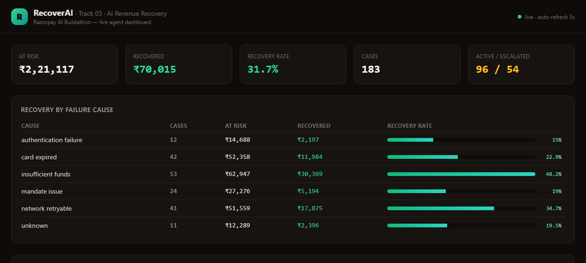
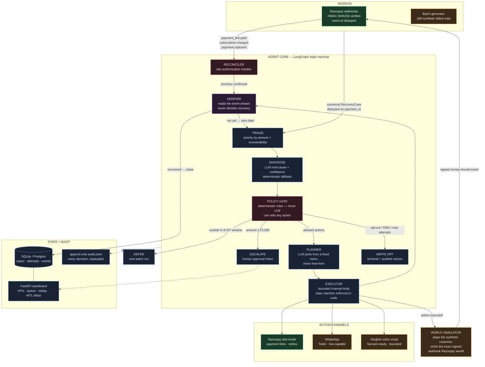
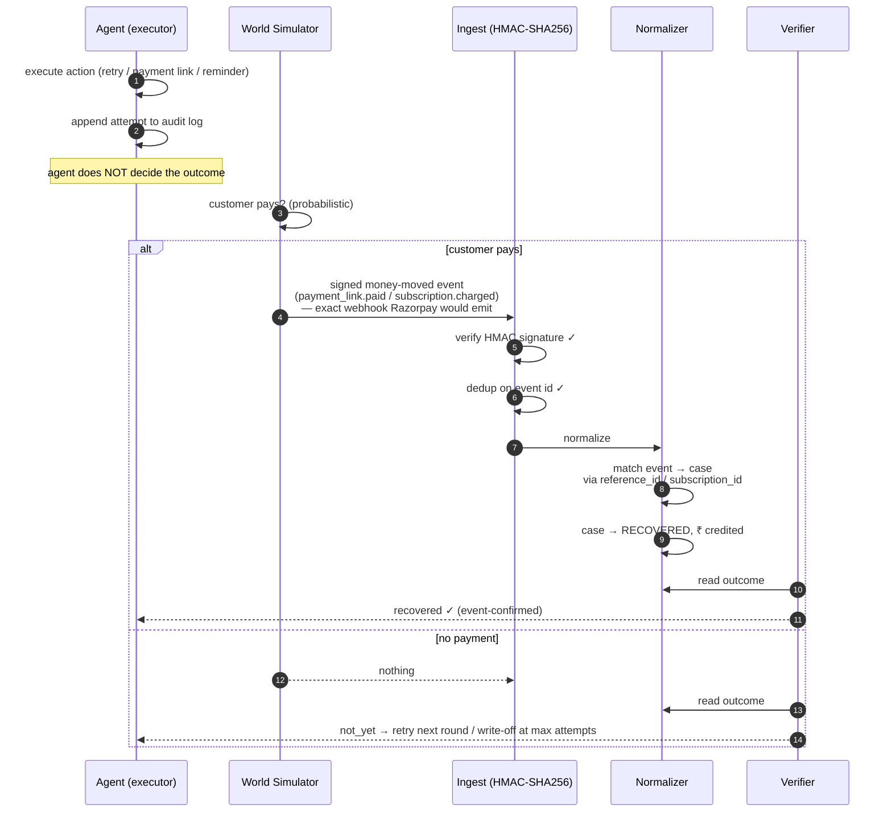
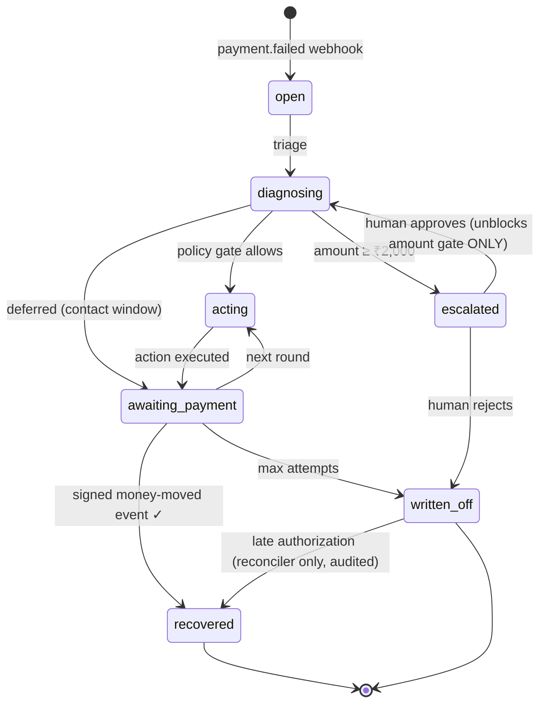

# RecoverAI

> **An AI agent that recovers failed subscription payments on Razorpay.**
> It detects revenue at risk, diagnoses *why* the payment failed, executes a compliant recovery action — and only counts money it can prove came back.
>
> **Track 03 · AI Revenue Recovery — Razorpay AI Buildathon 2026**

---

## 🔴 Live demo

**https://recoverai-app-production.up.railway.app/dashboard**

A live instance runs on a Daytona sandbox (test mode, synthetic data). What you can do there:

- Read the KPIs and per-cause recovery bars — a fresh batch runs in the sandbox, so its numbers are live and will differ slightly from the table below
- Open the **Human Approval inbox** and approve a ≥ ₹2,000 case — watch the gate unblock, the reminder fire, and the KPIs move
- Click any case → **replay its full decision trail** from the audit log

If the link is ever slow or asleep, the sandbox restarts in one command (`daytona sandbox start <id>`) and all state persists — nothing is lost. Everything in this README runs locally with the same one command shown in [Run it](#run-it).

---

## The problem in one paragraph

When a subscription payment fails — card expired, insufficient balance, revoked UPI mandate — the revenue doesn't come back on its own. Nobody emails the customer, nobody retries at the right moment, nobody notices the mandate broke. Collections teams chase these by hand: spreadsheets, cold calls, timing guesswork. It's slow, inconsistent, and easy to get wrong — message someone at midnight, or someone who opted out, and a revenue problem becomes a **compliance** problem. RecoverAI closes that loop: detect → diagnose → act → verify, with hard rails around every step.

---

## Results — 186-case synthetic batch, end-to-end on Razorpay test-mode APIs

| Metric | Value |
|---|---|
| Failed payments detected | **186 cases** |
| Revenue at risk | **₹2,21,614** |
| Autonomously recovered | **₹84,990** |
| Recovery rate | **38.4%** |
| Policy breaches | **0** — every customer contact passed every gate |
| Human escalations (≥ ₹2,000 queue) | 40 pending, ₹1.1L |

Per-cause recovery rate — the agent adapts strategy to the failure:

| Cause | Cases | At risk | Recovered | Rate |
|---|---|---|---|---|
| card_expired | 37 | ₹46,263 | ₹21,777 | **47.1%** |
| insufficient_funds | 59 | ₹59,841 | ₹25,659 | **42.9%** |
| network_retryable | 37 | ₹47,763 | ₹18,577 | 38.9% |
| unknown | 9 | ₹11,991 | ₹4,495 | 37.5% |
| mandate_issue | 23 | ₹27,477 | ₹7,193 | 26.2% |
| authentication_failure | 21 | ₹28,279 | ₹7,289 | 25.8% |

**Every rupee above was confirmed by a signed money-moved event flowing through the same HMAC-verified ingest path as live Razorpay traffic.** The agent cannot mark a case recovered by itself — see [The recovery guarantee](#the-recovery-guarantee).



---

## The demo in 60 seconds

1. **"186 cases, ₹2.2L at risk"** — live KPI cards, refreshing every 5s
2. **"₹85K recovered, zero policy breaches"** — per-cause recovery bars
3. **"Watch it think"** — click any case → full decision-trail replay: triage → diagnose (with confidence) → policy checks → plan → execute → verify
4. **"Humans stay in control"** — approve a ≥₹2,000 case live → the amount gate unblocks → the reminder fires → KPIs move in real time
5. **"It survives failures"** — run `python -m app.demo.late_authorization` → watch a written-off case reconcile itself when the money shows up days later

---

## Architecture



*Legend: green = real plumbing · amber = simulated · blue = agent reasoning · red = hard gates · purple = verification*

### How the agent thinks, node by node

| Node | What it does | Why it's built this way |
|---|---|---|
| **Triage** | Sets priority by amount × recoverability | Cheap, deterministic — no LLM needed |
| **Diagnose** | LLM maps Razorpay error codes to a root cause + confidence. Falls back to a deterministic error-code mapper when the LLM fails or rate-limits | An LLM outage means a *dumber* diagnosis, never a wrong one. Measured: 146/186 cases ran on the fallback during a Groq rate-limit storm — **0 misclassifications** |
| **Policy Gate** | Contact window 9 AM–9 PM IST, opt-out/DND suppression, max 5 attempts, human approval ≥ ₹2,000. Deterministic Python, can veto any action | Compliance rules must never be a prompt |
| **Planner** | LLM picks exactly one action from a fixed menu and drafts the message (Hinglish when preferred) | Bounded creativity inside rails it cannot leave |
| **Executor** | Runs the action; state-machine transitions, attempt caps and idempotency keys enforced in code | The LLM never touches money directly |
| **Verifier** | Reads the event stream — recovery is only real when a signed money-moved event matches the case | The agent can never mark its own wins |
| **Reconciler** | A genuine `payment.captured` after write-off reconciles the case, credits the money, guarantees no further contact | The only legal exit from a terminal state |
| **Write-off / Defer / Escalate** | Explicit terminal and waiting states, each with an audited reason | No case is ever silently dropped |

---

## The recovery guarantee

The core honesty mechanic. Money is only counted when an event proves it:



The same ingest path serves **live** Razorpay traffic and **simulated** world events — one code path, one set of rules, no shortcuts. In production, the World Simulator is simply removed and real webhooks do the confirming.

---

## Case lifecycle



Two deliberate design decisions visible here:

- **Approval unblocks only the amount gate.** A human "yes" can't override opt-outs, contact windows, or attempt caps. (Found and fixed via browser testing — an earlier version re-hit the ₹2,000 gate on re-run, creating an infinite escalation loop.)
- **`written_off` is terminal for agent actions.** The only exit is the reconciler handling a genuine late authorization — because a write-off means "we stop," and only money itself should reopen that door.

---

## Guardrails & human-in-the-loop

- Cases **≥ ₹2,000** land in the dashboard's Human Approval inbox before any customer contact
- Opted-out customers show a badge in the inbox; approving their case **writes it off** (the compliant outcome) instead of looping
- Every rejection moves the case to an explicit terminal state with the reason in the audit log
- Every money action is explainable after the fact — the dashboard replays the full decision trail from `audit.jsonl`

---

## Built to fail gracefully (evidence, not claims)

This project was deliberately attacked — an API fuzzing + browser break-it session ran against it before submission. **7 bugs found, 7 fixed, all re-verified** (full report: [`dogfood-output/report.md`](dogfood-output/report.md)). The two that matter most:

**1. The webhook signature bug that would have broken production.**
Fuzzing revealed the ingest path verified HMAC signatures against a *re-serialized* JSON body rather than the raw bytes the sender signed. Every real Razorpay webhook — whose byte format differs from Python's `json.dumps` — would have been rejected as `invalid_signature`. Fixed by verifying against the exact raw body; both live traffic and simulation now flow through one verified path.

**2. The infinite approval loop for opted-out customers.**
Approving an opted-out case bounced it straight back to the human inbox — the operator would click "approve" forever with zero feedback. Root cause: opt-out violations routed to *escalation*, which re-escalates on the next pass. Fixed: opted-out cases **write off** on approval (the only compliant outcome — no human can make contacting them legal), with the reason audited.

Plus: a hostile webhook with a ₹10-quadrillion amount corrupted the headline metrics (plausibility ceiling added, audited rejection); malformed webhook bodies returned 500s (now 400s); invalid filters 500'd (now 400 with valid values); the audit log leaked ghost events across DB generations (now rotated per batch).

**The late-authorization demo** — the track's "one failure handled gracefully":

```bash
python -m app.demo.late_authorization
```

A written-off case (all attempts exhausted) gets a `payment.captured` webhook days later — the issuing bank authorized the original charge after all. The reconciler pulls the case out of `written_off`, credits the money, audits `late_authorization_reconciled`, and guarantees no further customer contact. Duplicate events are idempotent — no double-counting.

---

## Real vs simulated — full honesty

Judges should know exactly what is production plumbing and what is demo simulation. The simulation exists only because synthetic customers can't actually pay — and it plugs in at exactly one point.

| Component | Status |
|---|---|
| Webhook receiver (HMAC-SHA256 verify, event-id dedup) | **Real** — same path for live traffic and simulation |
| Razorpay test-mode API (payment links, subscription retry) | **Real** — creates genuine test-mode payment links |
| Recovery confirmation | **Real mechanics** — only signed money-moved events matched to a case count as recovered |
| LLM diagnose + planner (Groq, OpenAI-compatible) | **Real**, with deterministic fallback (measured: 146/186 LLM diagnoses hit rate limits mid-batch — 0 misclassifications) |
| Policy gates, state machine, audit log, HITL inbox | **Real** |
| WhatsApp delivery (Twilio) | **Live-capable** — without credentials runs as `simulated`, never recorded as delivered |
| Hinglish voice (Sarvam TTS + Twilio Voice) | **Script stage** — bounded 6-sentence consent-first script generated, stored, replayable; live call path behind credentials |
| Whether a synthetic customer pays | **Simulated** (`app/worldsim.py`) — emits the exact signed webhook Razorpay would, through the same ingest path |

---

## Tech stack & why

| Layer | Choice | Why |
|---|---|---|
| Agent | **LangGraph** | This workflow is a *state machine with hard gates*, not a role-play team — explicit conditional edges, persisted transitions (the audit trail), clean human-in-the-loop interrupts |
| LLM | Groq (OpenAI-compatible), model-configurable | Cheap loop calls; deterministic fallbacks keep the system honest when the model rate-limits |
| API | FastAPI | Webhook receiver + dashboard API, async ack |
| DB | SQLAlchemy + SQLite (Postgres-ready) | Durable case state, zero-infra demo |
| Payments | Razorpay test-mode APIs | Payment links, subscription retry, webhooks |
| Dashboard | Single-page vanilla JS | Live KPIs, case replay, HITL inbox — zero build step |
| Tests | pytest, 11 tests | Signature/dedup, state-machine legality, event-driven confirmation, late-auth idempotency, channel honesty, full agent loop |

---

## Run it

```bash
git clone https://github.com/anikdascodes/recoverai-razorpay-buildathon.git
cd recoverai-razorpay-buildathon

python -m venv .venv
.venv\Scripts\activate            # Windows (source .venv/bin/activate on mac/linux)
pip install -r requirements.txt

copy .env.example .env            # fill RZP_TEST keys + LLM_API_KEY
```

| Variable | Where to get it |
|---|---|
| `RZP_KEY_ID`, `RZP_KEY_SECRET` | Razorpay Dashboard → Settings → API Keys (**test mode**) |
| `RZP_WEBHOOK_SECRET` | Your webhook endpoint secret |
| `LLM_API_KEY` | [Groq](https://console.groq.com) (OpenAI-compatible) |
| `AGENT_MODEL` | Defaults to `gemini-2.5-flash` |
| `TWILIO_*`, `SARVAM_API_KEY` | Optional — without them WhatsApp/voice run honestly labeled as simulated |

```bash
uvicorn app.main:app --port 8000             # API + dashboard

python -m app.generator.batch --customers 120   # seed synthetic failed subscriptions
python -m app.agent.run_batch                   # run the agent across all open cases
python -m app.demo.late_authorization           # graceful-failure demo
pytest tests/ -v                                # 11 tests
```

Open **http://localhost:8000/dashboard**

### API

| Method | Path | Purpose |
|---|---|---|
| POST | `/webhooks/razorpay` | HMAC-SHA256 verified webhook receiver (`payment.failed`, `payment_link.paid`, `payment.captured`, `subscription.charged`, …) |
| GET | `/stats` | Batch metrics: at-risk ₹, recovered ₹, rate by cause |
| GET | `/api/cases?state=` | Case queue (filterable) |
| GET | `/api/cases/{id}/timeline` | Full decision trail for case replay |
| GET | `/api/approvals` | Human approval inbox |
| POST | `/api/approvals/{id}/approve` | Approve → agent resumes with amount gate unlocked |
| POST | `/api/approvals/{id}/reject` | Reject → case written off |

---

## What's next

- **WhatsApp templates** through Twilio's approved template flow (plumbing exists; needs a provisioned WABA number)
- **Hinglish voice recovery** — Sarvam STT/TTS over Twilio Voice; the bounded consent-first scripts are already generated and stored
- **Cost-per-recovered-rupee** as a first-class metric (token usage is already in the audit log)
- **Langfuse tracing** for per-case LLM cost/latency

## Build log

| Days | Shipped |
|---|---|
| 1–2 | Scaffold, Razorpay test-mode integration, signed webhook receiver, synthetic batch generator |
| 3–4 | LangGraph agent core: triage → diagnose → policy gates → planner → executor → verifier |
| 5 | Interactive dashboard: live KPIs, per-cause bars, case replay, human approval inbox — first end-to-end HITL recovery verified in browser |
| 6 | Verifier rebuilt event-driven (single signed ingest path), worldsim, late-authorization reconciler, WhatsApp/voice channels with honest modes, API fuzzing + browser break-it session (7 bugs found & fixed), 11-test suite |
| 7 | Pitch video, final submission |

## Notes

- All data is **synthetic**; all Razorpay calls are **test mode**. No real customers are contacted.
- `audit.jsonl`, `*.db` are runtime artifacts and gitignored.
- Built for the Razorpay AI Buildathon 2026 — Track 03 (AI Revenue Recovery).
