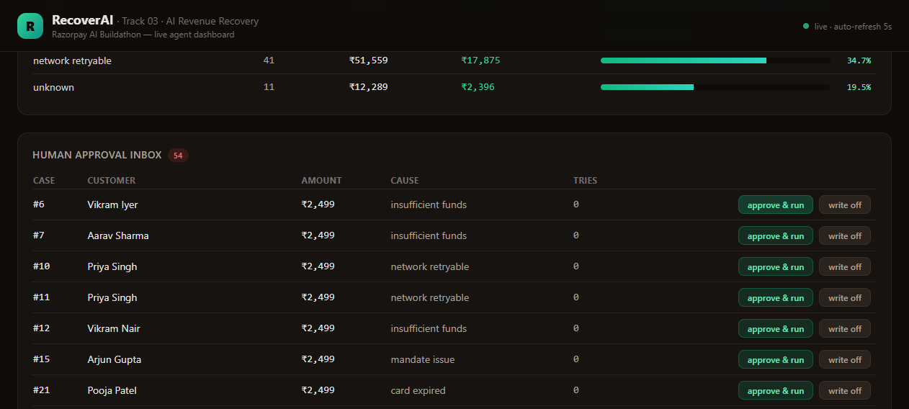

# RecoverAI

> AI agent that recovers failed subscription payments on Razorpay — detect revenue at risk, diagnose the root cause, execute compliant interventions, and measure actual money recovered.
>
> **Track 03 · Razorpay AI Buildathon 2026**

---

## Results (183-case synthetic batch, end-to-end)

| Metric | Value |
|---|---|
| Failed payments detected | **183 cases** |
| Revenue at risk | **₹2,21,117** |
| Autonomously recovered | **₹72,514** |
| Recovery rate | **32.8%** |
| Policy violations | **0** |
| Human escalations pending approval | 54 |

Per-cause recovery: `insufficient_funds` leads at **52.2%**, followed by `network_retryable` (auto-retried with zero customer contact), `card_expired`, and `mandate_issue`.

Every rupee reported above was confirmed by the agent's Verifier listening for Razorpay `subscription.charged` / `invoice.paid` events — not estimated.


## The demo in 60 seconds

1. **"183 cases, ₹2.2L at risk"** — KPI cards on the dashboard, refreshing live every 5s
2. **"The agent recovered ₹72K autonomously"** — per-cause recovery bars
3. **"Watch it think"** — click any case → full decision-trail replay: triage → diagnose → policy checks → plan → execute → verify, with confidences
4. **"Humans stay in control"** — approve a ≥₹2,000 case live → policy gate unblocks → WhatsApp reminder fires → money recovers in real time



## Architecture

```
              ┌──────────────────────────────────────────────────────┐
              │                     INGRESS                          │
              │   Razorpay webhooks ── Batch generator (synthetic)   │
              │   (HMAC-verified,        failed subscriptions        │
              │    idempotent)                                       │
              └──────────────────────────┬───────────────────────────┘
                                         ▼
              ┌──────────────────────────────────────────────────────┐
              │            NORMALIZER + DEDUPER                      │
              │     canonical RecoveryCase, dedup on payment_id      │
              └──────────────────────────┬───────────────────────────┘
                                         ▼
              ┌──────────────────────────────────────────────────────┐
              │         AGENT CORE (LangGraph state machine)         │
              │                                                      │
              │  TRIAGE ─▶ DIAGNOSE ─▶ POLICY GATE ─▶ PLANNER (LLM)  │
              │                            │                │        │
              │                       escalate          ▼            │
              │                       / write-off     EXECUTOR       │
              │                       / defer           │            │
              │                                         ▼            │
              │                                      VERIFIER        │
              └──────────────────────────┬───────────────────────────┘
                                         ▼
              ┌──────────────────────────────────────────────────────┐
              │      CHANNELS: Razorpay retry/payment links,         │
              │      WhatsApp reminders, Hinglish voice (roadmap)    │
              └──────────────────────────┬───────────────────────────┘
                                         ▼
              ┌──────────────────────────────────────────────────────┐
              │   SQLite/Postgres state · append-only JSONL audit    │
              │   · FastAPI dashboard (KPIs, queue, replay, HITL)    │
              └──────────────────────────────────────────────────────┘
```

### How the agent thinks

| Node | What it does |
|---|---|
| **Triage** | Classifies case priority by amount × recoverability |
| **Diagnose** | Maps Razorpay error codes to root cause (`card_expired`, `insufficient_funds`, `mandate_issue`, `network_retryable`, `authentication_failure`, `unknown`) + confidence. Low confidence → escalate, never guess |
| **Policy Gate** | **Deterministic rules, not LLM**: contact window 9 AM–9 PM IST, opt-out/DND suppression, max attempts per case, cooling-off between touches, human approval required above ₹2,000. Can veto any action |
| **Planner (LLM)** | Picks one action from a fixed menu (`retry_payment`, `whatsapp_reminder`, `payment_link`, `voice_call`, `pause_and_offer`, `escalate_human`) — never free-form |
| **Executor** | Runs the action through bounded channel tools; caps and idempotency enforced in code |
| **Verifier** | Confirms real recovery via Razorpay charge/paid events, or times out → write-off |

### Why LangGraph

This workflow is a *state machine with hard gates*, not a role-play team. LangGraph gives explicit conditional edges, persisted node transitions (the audit trail), and a clean pattern for human-in-the-loop interrupts.

## Guardrails & human-in-the-loop

- Cases **≥ ₹2,000** are escalated to the dashboard's Human Approval inbox before any customer contact
- Approval unblocks **only the amount gate** — compliance gates (opt-out, contact window, attempt caps) still apply
- Opted-out customers show a badge in the inbox and are never contacted
- Rejections move the case to an explicit terminal state (`written_off`), never silently dropped

> **Bug found & fixed via browser testing:** re-running an approved case hit the ₹2,000 gate again (infinite escalation loop). The `human_approved` flag now unblocks only the amount gate. Verified: case #6 → approved → WhatsApp reminder sent → ₹2,499 recovered → inbox count dropped live on the dashboard.

## Audit trail & case replay

Every agent decision is appended to an immutable JSONL log:

```json
{"ts": "2026-08-25T08:14:03Z", "case_id": 6, "node": "policy_gate",
 "decision": "blocked", "reason": "amount_above_human_threshold",
 ...}
```

The dashboard replays any case's full decision trail from this log — every policy check, tool call, and outcome is explainable after the fact.

## Quickstart

```bash
git clone https://github.com/anikdascodes/recoverai-razorpay-buildathon.git
cd recoverai-razorpay-buildathon

python -m venv .venv
source .venv/bin/activate        # Windows: .venv\Scripts\activate
pip install -r requirements.txt

cp .env.example .env             # Windows: copy .env.example .env
```

Fill `.env`:

| Variable | Where to get it |
|---|---|
| `RZP_KEY_ID`, `RZP_KEY_SECRET` | Razorpay Dashboard → Settings → API Keys (**test mode**) |
| `RZP_WEBHOOK_SECRET` | Your webhook endpoint secret |
| `LLM_API_KEY` | [Groq](https://console.groq.com) API key (OpenAI-compatible) |
| `AGENT_MODEL` | Defaults to `gemini-2.5-flash` |

Run it:

```bash
uvicorn app.main:app --port 8000             # API + dashboard

# seed a synthetic batch of failed subscriptions
python -m app.generator.batch --customers 120

# run the agent across all open cases
python -m app.agent.run_batch
```

Open **http://localhost:8000/dashboard**

## API

| Method | Path | Purpose |
|---|---|---|
| POST | `/webhooks/razorpay` | HMAC-SHA256 verified webhook receiver (`payment.failed`, `subscription.charged`, …) |
| GET | `/stats` | Batch metrics: at-risk ₹, recovered ₹, rate by cause |
| GET | `/api/cases?state=` | Case queue (filterable) |
| GET | `/api/cases/{id}/timeline` | Full decision trail for case replay |
| GET | `/api/approvals` | Human approval inbox |
| POST | `/api/approvals/{id}/approve` | Approve → agent resumes with amount gate unlocked |
| POST | `/api/approvals/{id}/reject` | Reject → case written off |

## Tests

```bash
pytest tests/ -v
```

## Build log

| Days | Shipped |
|---|---|
| 1–2 | Scaffold, Razorpay test-mode integration, signed webhook receiver, synthetic batch generator |
| 3–4 | LangGraph agent core: triage → diagnose → policy gates → planner → executor → verifier |
| 5 | Interactive dashboard: live KPIs, per-cause bars, case replay, human approval inbox — first end-to-end HITL recovery verified in browser |
| 6–7 | *(next)* WhatsApp template polish + Hinglish voice agent (Sarvam STT/TTS) |
| 8 | Failure-handling demo cases (late authorization reconciliation) |
| 9–10 | Pitch video, README polish, final submission |

## Notes

- All data is **synthetic**; all Razorpay calls are **test mode**. No real customers are contacted.
- `audit.jsonl` and `*.db` are runtime artifacts and gitignored.
